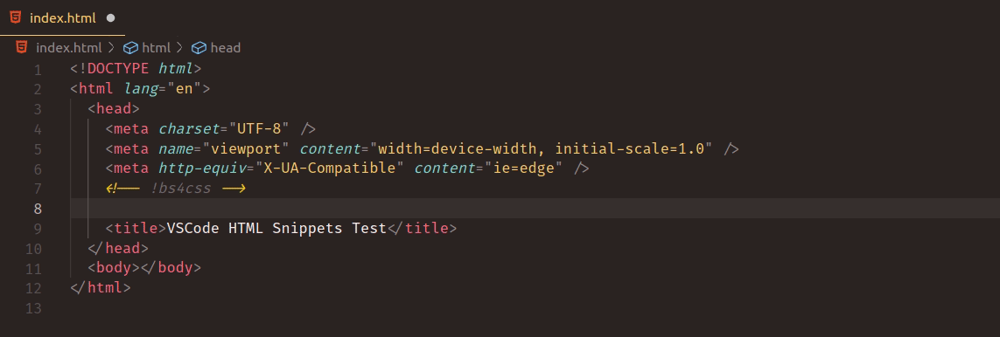

# bs4snippets README

This is an example Visual Studio Code "snippet" extension.

## Features

Quickly generate a bootstrap 4 CSS CDN link using the following command:

```
!bs4css
```



## Release Notes

### 1.0.0

## Initial release of BS4Snippets extension
